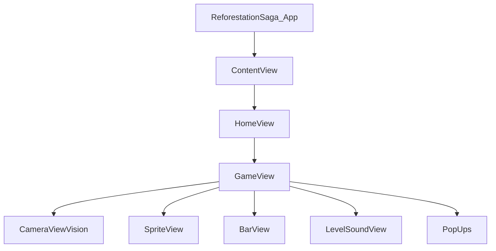

## Architecture Overview

Reforestation Saga is built using a hybrid architecture that combines SwiftUI for UI management, SpriteKit for game rendering, and Apple's Vision framework for eye blink detection. The app follows the MVVM pattern with observable objects managing shared state.

## Core Technologies

<CardGroup cols={3}>
  <Card title="SwiftUI" icon="mobile">
    Modern declarative UI framework for views and navigation
  </Card>
  <Card title="SpriteKit" icon="gamepad">
    2D game engine for physics and sprite rendering
  </Card>
  <Card title="Vision" icon="eye">
    Face detection and landmark tracking for blink detection
  </Card>
</CardGroup>

## Application Entry Point

The app initializes with a shared `EyeBlinkDetectorVision` instance that's injected throughout the view hierarchy:

```swift ReforestationSaga_App.swift
@main
struct ReforestationSaga_App: App {
    @StateObject private var detector = EyeBlinkDetectorVision()
    var body: some Scene {
        WindowGroup {
            ContentView()
                .environmentObject(detector)
        }
    }
}
```

## State Management Architecture

### Environment Objects

The app uses three primary observable objects shared across views:

<Tabs>
  <Tab title="EyeBlinkDetectorVision">
    Manages camera session, face detection, and blink counting:

    ```swift
    class EyeBlinkDetectorVision: NSObject, ObservableObject, 
                                  AVCaptureVideoDataOutputSampleBufferDelegate {
        @Published var blinkCount = 0
        private var isEyeClosed = false
        private let session = AVCaptureSession()
        // ...
    }
    ```

    Key responsibilities:
    - AVFoundation camera session management
    - Vision framework face landmark detection
    - Eye Aspect Ratio (EAR) computation
    - Blink event publishing
  </Tab>
  
  <Tab title="GameData">
    Persists player progress using UserDefaults:

    ```swift ContentView.swift
    class GameData: ObservableObject {
        @Published var highestLevel: Int = UserDefaults.standard.savedHighestLevel
    }
    ```

    Tracks the highest level achieved by the player.
  </Tab>
  
  <Tab title="GameMusicManager">
    Singleton audio manager for background music and sound effects:

    ```swift GameMusicManager.swift
    class GameMusicManager {
        static let shared = GameMusicManager()
        private var audioPlayer: AVAudioPlayer?
        private var effectPlayers: [AVAudioPlayer] = []
        
        func playMusic(filename: String = "GameEasy", 
                      fileExtension: String = "mp3") {
            // AVAudioPlayer setup with infinite loop
            audioPlayer?.numberOfLoops = -1
            audioPlayer?.play()
        }
    }
    ```
  </Tab>
</Tabs>

## View Hierarchy

The application uses a multi-layer view architecture:



### GameView Integration

`GameView` orchestrates the integration between camera, game engine, and UI:

```swift GameView.swift
struct GameView: View {
    @EnvironmentObject var detector: EyeBlinkDetectorVision
    @EnvironmentObject var gameData: GameData
    @State private var scene: GameScene?
    @State private var treesRemaining: Int = 3
    @State private var currentLevel: Int = 1
    
    var body: some View {
        ZStack {
            CameraViewVision(eyeBlinkDetector: detector)
            Image("background")
            SpriteView(scene: scene ?? GameScene(size: UIScreen.main.bounds.size),
                      options: [.allowsTransparency])
            // UI overlays
        }
        .onChange(of: detector.blinkCount) {
            scene?.shootNeedle()
        }
    }
}
```

<Note>
  The `onChange(of: detector.blinkCount)` modifier creates a reactive binding between Vision framework detection and SpriteKit game actions.
</Note>

## Data Flow

<Steps>
  <Step title="Camera Capture">
    AVCaptureSession captures video frames at 30 fps, downsampled to process every 3rd frame for performance.
  </Step>
  
  <Step title="Face Detection">
    Vision framework analyzes frames using `VNDetectFaceLandmarksRequest` to identify eye landmarks.
  </Step>
  
  <Step title="Blink Detection">
    Eye Aspect Ratio (EAR) algorithm determines if eyes are closed (threshold < 0.1).
  </Step>
  
  <Step title="State Update">
    `@Published var blinkCount` increments, triggering SwiftUI's `onChange` modifier.
  </Step>
  
  <Step title="Game Action">
    `GameScene.shootNeedle()` executes, creating SKSpriteNode with SKAction animations.
  </Step>
  
  <Step title="Collision Detection">
    SpriteKit checks if needle intersects forbidden zones or existing trees.
  </Step>
</Steps>

## Level Progression System

The game uses a mathematical formula for dynamic difficulty scaling:

```swift GameView.swift
func treesForLevel(_ level: Int) -> Int {
    let base = 3
    let cycle = (level - 1) / 5
    let positionInCycle = (level - 1) % 5
    return base + cycle + positionInCycle
}
```

### Difficulty Progression

<Tabs>
  <Tab title="Levels 1-5">
    ```swift
    rotationDuration = 4.0
    rotateLeft = false
    ```
    Fixed slow clockwise rotation.
  </Tab>
  
  <Tab title="Levels 6-10">
    ```swift
    rotationDuration = 3.0
    rotateLeft = Bool.random()
    ```
    Faster rotation with random direction.
  </Tab>
  
  <Tab title="Levels 11+">
    ```swift
    rotationDuration = Double.random(in: 1.5...4)
    rotateLeft = Bool.random()
    ```
    Unpredictable rotation speed and direction.
  </Tab>
</Tabs>

## Performance Optimizations

### Frame Processing Throttling

```swift EyeBlinkDetectorVision.swift
func captureOutput(_ output: AVCaptureOutput, 
                  didOutput sampleBuffer: CMSampleBuffer,
                  from connection: AVCaptureConnection) {
    frameCount += 1
    guard frameCount % 3 == 0 else { return } // Process every 3rd frame
    // Vision framework processing...
}
```

<Info>
  Processing every 3rd frame (10 fps) reduces CPU usage by 66% while maintaining responsive blink detection.
</Info>

### Async Rendering

Camera session starts on background thread:

```swift
DispatchQueue.global(qos: .userInitiated).async {
    self.session.startRunning()
}
```

### Memory Management

```swift GameView.swift
func setupScene() {
    if let oldScene = scene {
        oldScene.removeAllActions()
        oldScene.removeAllChildren()
        oldScene.removeFromParent()
    }
    // Create new scene...
}
```

## Persistence Layer

Player progress is persisted using UserDefaults with type-safe extensions:

```swift GameView.swift
extension UserDefaults {
    private enum Keys {
        static let highestLevel = "highestLevel"
    }

    var savedHighestLevel: Int {
        get { integer(forKey: Keys.highestLevel) }
        set { set(newValue, forKey: Keys.highestLevel) }
    }
}
```

## Thread Safety

<Warning>
  Vision framework callbacks execute on background queue. All UI updates must dispatch to main thread:
  
  ```swift
  DispatchQueue.main.async {
      self.blinkCountLabel?.text = "Blink: \(self.blinkCount)"
  }
  ```
</Warning>

## Build Configuration

Debug builds include tap gesture for testing without camera:

```swift GameView.swift
#if DEBUG
.onTapGesture {
    if showInitialBlinkAlert {
        showInitialBlinkAlert = false
        hasPlantedFirstTree = true
        if (treesRemaining > 0) {
            scene?.shootNeedle()
        }
    }
}
#endif
```

## Next Steps

<CardGroup cols={2}>
  <Card title="Eye Detection Details" icon="eye" href="/technical/eye-detection">
    Deep dive into Vision framework integration
  </Card>
  <Card title="Game Engine" icon="gamepad" href="/technical/game-engine">
    SpriteKit implementation and physics
  </Card>
</CardGroup>